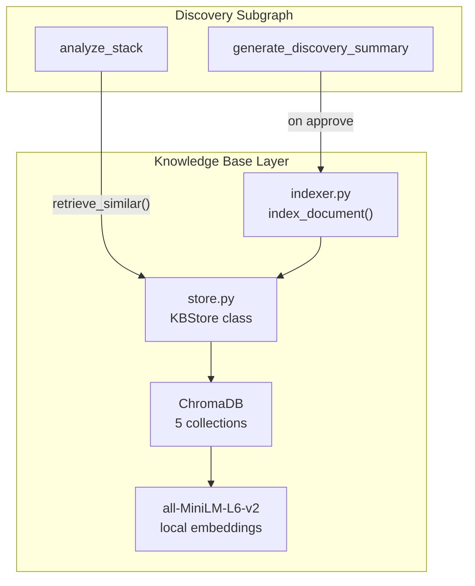

# Milestone 3: ChromaDB KB + Auto-Indexing + Retrieval

## Current State

- [src/kb/store.py](src/kb/store.py) and [src/kb/indexer.py](src/kb/indexer.py) are single-line stubs
- Dependencies already present: `chromadb>=1.5`, `sentence-transformers>=3.0`
- `Settings.chromadb_dir` and directory creation already wired in [src/config.py](src/config.py) / [src/main.py](src/main.py)
- `analyze_stack` currently uses only static prompts from Markdown files — no KB retrieval
- `generate_discovery_summary` has `interrupt()` approve flow but no post-approval indexing

## Architecture

## 5 Collections

Based on domain model in [src/graph/state.py](src/graph/state.py):

- **discovery_summaries** — approved discovery docs (from `generate_discovery_summary`)
- **stack_analyses** — tech stack analysis results (from `analyze_stack`)
- **use_cases** — identified use cases with tower_fit ratings
- **competitive_intel** — competitive intelligence gathered during engagements
- **meeting_notes** — meeting summaries and follow-up notes

Each document gets metadata: `customer_id`, `customer_name`, `phase`, `created_at`, plus collection-specific metadata (e.g., `cloud_provider`, `tower_fit` for filtering).

## Implementation Steps (TDD)

### 1. Implement `KBStore` in [src/kb/store.py](src/kb/store.py)

Write tests first in `tests/test_kb/test_store.py`:

- `KBStore` class wrapping ChromaDB `PersistentClient`
- `__init__(persist_dir)` creates client and 5 named collections with the shared embedding function
- Embedding function: `chromadb.utils.embedding_functions.SentenceTransformerEmbeddingFunction(model_name="all-MiniLM-L6-v2")`
- `add_document(collection_name, doc_id, text, metadata)` — upsert a document
- `retrieve_similar(collection_name, query, n_results=5, where=None)` — semantic search with optional metadata filter
- `get_document(collection_name, doc_id)` — exact retrieval by ID
- Module-level `get_kb_store()` singleton (lazy init, reads `settings.chromadb_dir`)

### 2. Implement `index_document()` in [src/kb/indexer.py](src/kb/indexer.py)

Write tests first in `tests/test_kb/test_indexer.py`:

- `async def index_approved_document(doc_type, content, customer_id, customer_name, metadata)` — routes to the correct collection and calls `store.add_document()`
- `index_stack_analysis(state)` — extracts stack analysis from state, indexes to `stack_analyses`
- `index_use_cases(state)` — indexes each use case separately to `use_cases`
- `index_discovery_summary(state, doc_content)` — indexes approved discovery summary

### 3. Wire retrieval into `analyze_stack`

Update [src/graph/discovery/analyze_stack.py](src/graph/discovery/analyze_stack.py):

- After building the prompt but before LLM call, call `retrieve_similar("stack_analyses", query, where={"cloud_provider": ...})` and `retrieve_similar("discovery_summaries", query)`
- Inject retrieved context as "Similar customer experiences" section in the prompt
- Add a new prompt variable `{similar_contexts}` to `ANALYZE_STACK_PROMPT` in [src/llm/prompts/discovery.py](src/llm/prompts/discovery.py)
- Gracefully handle empty KB (first customer = no results)

### 4. Wire auto-indexing into approval flows

Update [src/graph/discovery/generate_discovery_summary.py](src/graph/discovery/generate_discovery_summary.py):

- On approve, call `index_discovery_summary(state, summary_doc)` before returning
- This also triggers `index_stack_analysis` and `index_use_cases` for the full state

Update [src/graph/discovery/analyze_stack.py](src/graph/discovery/analyze_stack.py):

- After producing stack analysis, auto-index it (no approval needed since it's intermediate)

### 5. Initialize KB in app lifespan

Update [src/main.py](src/main.py):

- Import and call `get_kb_store()` in lifespan to warm up embeddings model on startup

### 6. Update MEMORY_BANK.md

Mark Milestone 3 as DONE, add any new patterns discovered.

## Test Strategy

- Mock ChromaDB client in unit tests (no actual embeddings in CI)
- One integration test that uses real ChromaDB in-memory mode to verify end-to-end indexing + retrieval
- Mock `get_kb_store()` when testing graph nodes that call retrieval
- Existing test patterns in [tests/test_graph/test_discovery.py](tests/test_graph/test_discovery.py) show the `patch` + `AsyncMock` approach to follow

## Files to Create

- `tests/test_kb/__init__.py`
- `tests/test_kb/test_store.py`
- `tests/test_kb/test_indexer.py`

## Files to Edit

- `src/kb/store.py` (replace stub)
- `src/kb/indexer.py` (replace stub)
- `src/graph/discovery/analyze_stack.py` (add KB retrieval)
- `src/graph/discovery/generate_discovery_summary.py` (add auto-indexing on approve)
- `src/llm/prompts/discovery.py` (add `{similar_contexts}` to `ANALYZE_STACK_PROMPT`)
- `src/main.py` (warm up KB store in lifespan)
- `tests/test_graph/test_discovery.py` (update mocks for KB calls)
- `MEMORY_BANK.md` (mark milestone 3 done)

