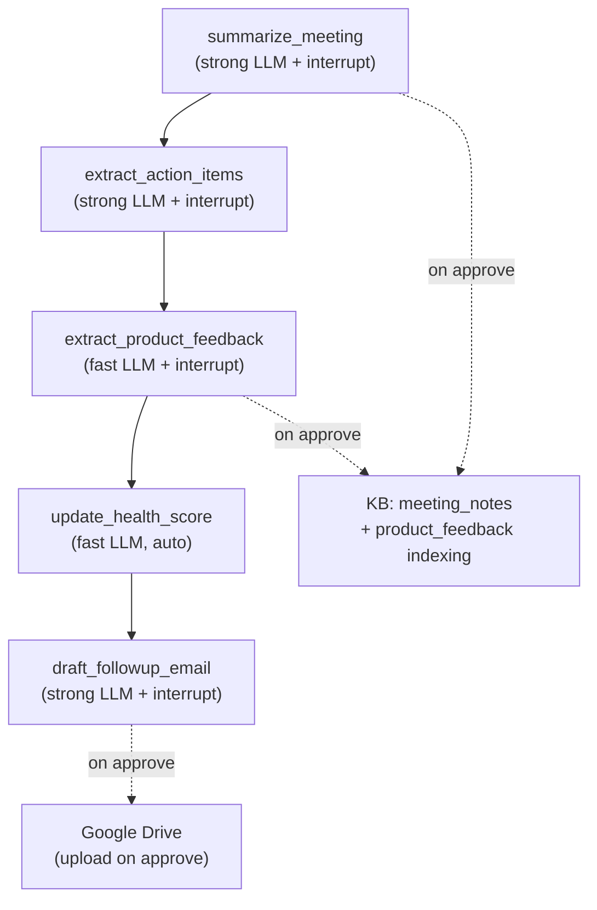

# Milestone 4: Follow-up Subgraph + Interrupt/Approval + Google Drive

## Current State

- 5 stub nodes in [src/graph/followup/](src/graph/followup/) return only `{"last_node": "..."}` with no LLM calls
- Bug in [src/graph/followup/extract_product_feedback.py](src/graph/followup/extract_product_feedback.py): function named `extract_action_items` instead of `extract_product_feedback`
- [src/integrations/gdrive.py](src/integrations/gdrive.py) is a single-line placeholder
- KB collections `meeting_notes` and `competitive_intel` exist but have no indexer functions
- Followup fixture already exists: [tests/fixtures/emails/followup/001_acme_meeting_notes.json](tests/fixtures/emails/followup/001_acme_meeting_notes.json)
- `conftest.py` already provides `followup_emails` fixture

## Subgraph Flow

## Implementation Steps (TDD order)

### 1. Create followup prompts module

New file: `src/llm/prompts/followup.py`

5 prompt templates following the pattern in [src/llm/prompts/discovery.py](src/llm/prompts/discovery.py):

- **SUMMARIZE_MEETING_PROMPT** — structured meeting summary from raw notes (attendees, topics, decisions, next steps)
- **EXTRACT_ACTION_ITEMS_PROMPT** — pull action items with owner/due/status from meeting summary
- **EXTRACT_PRODUCT_FEEDBACK_PROMPT** — identify feature requests, bugs, capability gaps tagged by area + severity
- **UPDATE_HEALTH_SCORE_PROMPT** — recompute health_score from all engagement signals (MEDDIC-adapted)
- **DRAFT_FOLLOWUP_EMAIL_PROMPT** — compose follow-up email with summary, action items, next steps

### 2. Add KB indexer functions

Edit [src/kb/indexer.py](src/kb/indexer.py) — add:

- `index_meeting_notes(state, summary_content)` -> `meeting_notes` collection
- `index_product_feedback(state)` -> iterates `product_feedback` list, indexes each to `competitive_intel` collection (reusing existing collection since product feedback is competitive intelligence)

Tests first in [tests/test_kb/test_indexer.py](tests/test_kb/test_indexer.py).

### 3. Implement Google Drive integration

Edit [src/integrations/gdrive.py](src/integrations/gdrive.py):

- `GDriveClient` class wrapping `google-api-python-client`
- `create_doc(title, content) -> str` (returns doc URL)
- `get_gdrive_client()` singleton with graceful degradation (returns `None` if no credentials)
- OAuth2 flow via `google-auth-oauthlib` with credentials from `Settings`

Edit [src/config.py](src/config.py) — add:

- `google_credentials_path: Path | None = None`

Graceful: if no credentials, `get_gdrive_client()` returns `None` and nodes skip upload (same pattern as KB degradation). `gdrive_url` stays `None` in doc records.

Tests in new file `tests/test_integrations/test_gdrive.py` (mock Google API).

### 4. Implement follow-up nodes (TDD)

Write tests first in new file `tests/test_graph/test_followup.py`, then implement each node:

**a. `summarize_meeting`** — [src/graph/followup/summarize_meeting.py](src/graph/followup/summarize_meeting.py)

- LLM: `get_llm("strong")`
- Input: last message (meeting notes/transcript)
- Output: structured summary -> appended to `meeting_summaries`
- `interrupt()` for FDE review of summary
- On approve: `index_meeting_notes()` to KB

**b. `extract_action_items`** — [src/graph/followup/extract_action_items.py](src/graph/followup/extract_action_items.py)

- LLM: `get_llm("strong")`
- Input: latest meeting summary from state
- Output: list of `ActionItem` dicts -> set `action_items`
- `interrupt()` for FDE to review/edit assignments

**c. `extract_product_feedback`** — [src/graph/followup/extract_product_feedback.py](src/graph/followup/extract_product_feedback.py)

- Fix function name bug (`extract_action_items` -> `extract_product_feedback`)
- LLM: `get_llm("fast")`
- Input: meeting summary + action items
- Output: list of `ProductFeedback` dicts -> set `product_feedback`
- `interrupt()` for FDE to review severity ratings
- On approve: `index_product_feedback()` to KB

**d. `update_health_score`** — [src/graph/followup/update_health_score.py](src/graph/followup/update_health_score.py)

- LLM: `get_llm("fast")`
- Input: full state (stakeholders, action items, meeting history, qualification)
- Output: updated `health_score` (0-100)
- Auto (no interrupt) — intermediate computation

**e. `draft_followup_email`** — [src/graph/followup/draft_followup_email.py](src/graph/followup/draft_followup_email.py)

- LLM: `get_llm("strong")`
- Input: meeting summary, action items, product feedback, customer info
- Output: email text -> `generated_docs` append
- `interrupt()` for FDE approval (approve/edit/reject, same pattern as `generate_discovery_summary`)
- On approve: upload to Google Drive via `GDriveClient` (if available), set `gdrive_url`

### 5. Update MEMORY_BANK.md

Mark Milestone 4 as DONE, document new patterns (follow-up interrupt flow, GDrive integration, meeting_notes indexing).

## Files to Create

- `src/llm/prompts/followup.py`
- `tests/test_graph/test_followup.py`
- `tests/test_integrations/__init__.py`
- `tests/test_integrations/test_gdrive.py`

## Files to Edit

- `src/graph/followup/summarize_meeting.py` (replace stub)
- `src/graph/followup/extract_action_items.py` (replace stub)
- `src/graph/followup/extract_product_feedback.py` (replace stub + fix function name)
- `src/graph/followup/update_health_score.py` (replace stub)
- `src/graph/followup/draft_followup_email.py` (replace stub)
- `src/graph/followup/__init__.py` (no changes needed unless flow changes)
- `src/integrations/gdrive.py` (implement)
- `src/kb/indexer.py` (add `index_meeting_notes`, `index_product_feedback`)
- `src/config.py` (add `google_credentials_path`)
- `tests/test_kb/test_indexer.py` (add tests for new indexer functions)
- `MEMORY_BANK.md` (mark milestone 4 done)

## Test Strategy

- Mock `get_llm()` with `AsyncMock` returning `AIMessage(content=json.dumps(...))`
- Mock `get_kb_store()` for KB indexing verification
- Mock `interrupt()` via `patch("langgraph.types.interrupt")` to simulate approve/edit/reject
- Mock Google API client for gdrive tests
- Follow patterns from [tests/test_graph/test_discovery.py](tests/test_graph/test_discovery.py)
- Use existing `followup_emails` fixture from `conftest.py`

