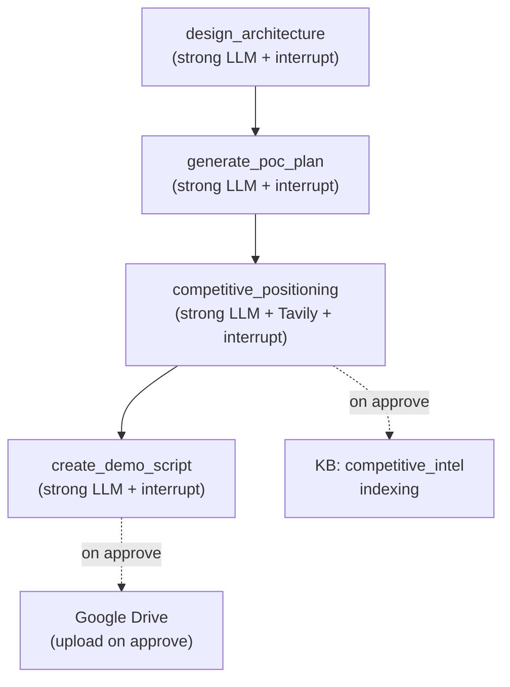

# Milestone 5: PoC Subgraph + Tavily Competitive Research

## Current State

- 4 stub nodes in [src/graph/poc/](src/graph/poc/) return only `{"last_node": "..."}` with no LLM calls
- [src/integrations/tavily_search.py](src/integrations/tavily_search.py) is a single-line placeholder
- `tavily_api_key` already configured in `src/config.py`
- PoC fixture exists: [tests/fixtures/emails/poc/001_acme_poc_scoping.json](tests/fixtures/emails/poc/001_acme_poc_scoping.json)
- `CompetitiveIntel` TypedDict and `competitive_intel` list already in `CustomerState`
- `conftest.py` already provides `poc_emails` fixture
- Subgraph wiring in `__init__.py` is already correct (linear pipeline)

## Subgraph Flow

## Implementation Steps (TDD order)

### 1. Create PoC prompts module

New file: `src/llm/prompts/poc.py`

4 prompt templates following established patterns:

- **DESIGN_ARCHITECTURE_PROMPT** — Design Tower target architecture from tech_env, use_cases, stack_analysis. Include migration path, component mapping, data flow diagram description.
- **GENERATE_POC_PLAN_PROMPT** — Concrete PoC scope with pipelines, datasets, success criteria, timeline, resource requirements.
- **COMPETITIVE_POSITIONING_PROMPT** — Competitive comparison using Tavily research results + KB intel. Tower vs competitors on specific dimensions.
- **CREATE_DEMO_SCRIPT_PROMPT** — Step-by-step demo walkthrough using customer's specific data, pipelines, and pain points.

### 2. Add Tavily dependency and implement client

`uv add tavily-python`

Edit [src/integrations/tavily_search.py](src/integrations/tavily_search.py):

- `TavilySearchClient` class wrapping `tavily-python`
- `search(query, max_results=5) -> list[dict]` — returns `[{title, url, content, score}]`
- `get_tavily_client()` singleton with graceful degradation (returns `None` if no API key)

Tests in `tests/test_integrations/test_tavily.py` (mock Tavily API).

### 3. Add KB indexer function

Edit [src/kb/indexer.py](src/kb/indexer.py):

- `index_competitive_intel(state)` — iterates `competitive_intel` list, indexes each to `competitive_intel` collection

Tests in [tests/test_kb/test_indexer.py](tests/test_kb/test_indexer.py).

### 4. Implement PoC nodes (TDD)

Write tests first in new file `tests/test_graph/test_poc.py`, then implement each node:

**a. `design_architecture`** — [src/graph/poc/design_architecture.py](src/graph/poc/design_architecture.py)

- LLM: `get_llm("strong")`
- Input: tech_env, use_cases, stack_analysis (from discovery), tower knowledge
- Output: architecture doc → appended to `generated_docs`
- `interrupt()` for FDE review (approve/edit/reject)
- On approve: store architecture in meeting_summaries as `type: "poc_architecture"`

**b. `generate_poc_plan`** — [src/graph/poc/generate_poc_plan.py](src/graph/poc/generate_poc_plan.py)

- LLM: `get_llm("strong")`
- Input: architecture, use_cases, latest message (PoC scoping email)
- Output: PoC plan doc → appended to `generated_docs`
- `interrupt()` for FDE review (approve/edit/reject)

**c. `competitive_positioning`** — [src/graph/poc/competitive_positioning.py](src/graph/poc/competitive_positioning.py)

- LLM: `get_llm("strong")` + Tavily for web research
- Input: tech_env (current_warehouse = competitor), KB competitive_intel, Tavily search results
- Output: competitive intel items → `competitive_intel` list + positioning doc → `generated_docs`
- `interrupt()` for FDE review
- On approve: `index_competitive_intel()` to KB

**d. `create_demo_script`** — [src/graph/poc/create_demo_script.py](src/graph/poc/create_demo_script.py)

- LLM: `get_llm("strong")`
- Input: architecture, PoC plan, customer info, use_cases
- Output: demo script doc → `generated_docs`
- `interrupt()` for FDE review (approve/edit/reject)
- On approve: upload to Google Drive via `GDriveClient` (if available)

### 5. Update MEMORY_BANK.md

Mark Milestone 5 as DONE, document new patterns (Tavily integration, competitive positioning, PoC architecture flow).

## Files to Create

- `src/llm/prompts/poc.py`
- `tests/test_graph/test_poc.py`
- `tests/test_integrations/test_tavily.py`

## Files to Edit

- `src/graph/poc/design_architecture.py` (replace stub)
- `src/graph/poc/generate_poc_plan.py` (replace stub)
- `src/graph/poc/competitive_positioning.py` (replace stub)
- `src/graph/poc/create_demo_script.py` (replace stub)
- `src/integrations/tavily_search.py` (implement)
- `src/kb/indexer.py` (add `index_competitive_intel`)
- `tests/test_kb/test_indexer.py` (add tests for new indexer function)
- `MEMORY_BANK.md` (mark milestone 5 done)

## Test Strategy

- Mock `get_llm()` with `AsyncMock` returning `AIMessage(content=json.dumps(...))`
- Mock `interrupt()` via `patch("langgraph.types.interrupt")` to simulate approve/edit/reject
- Mock `get_tavily_client()` for Tavily search tests
- Mock `get_kb_store()` for KB indexing verification
- Mock `get_gdrive_client()` for GDrive upload tests
- Follow patterns from `tests/test_graph/test_followup.py`
- Use existing `poc_emails` fixture from `conftest.py`
